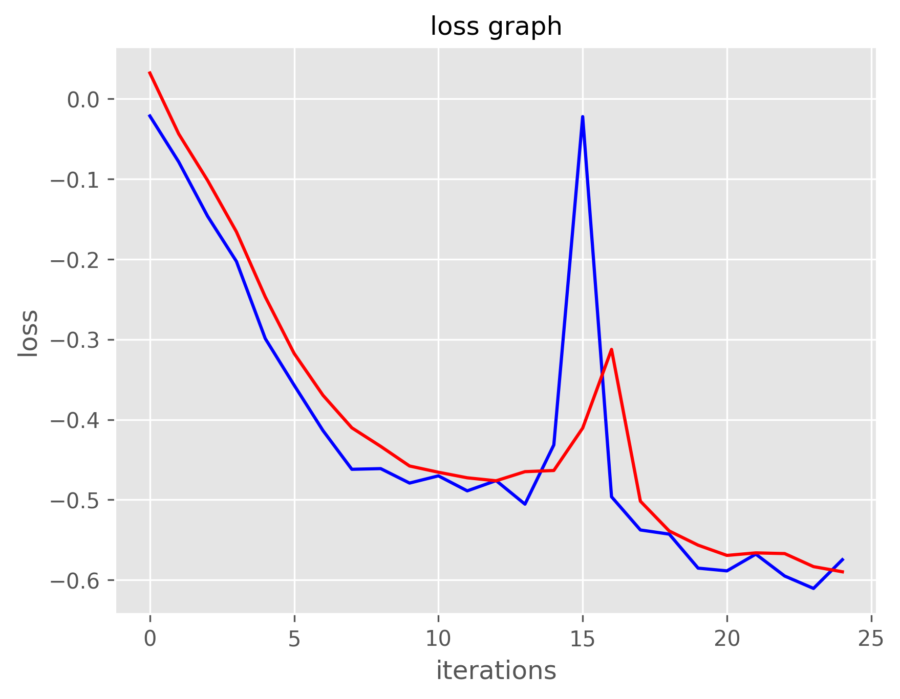
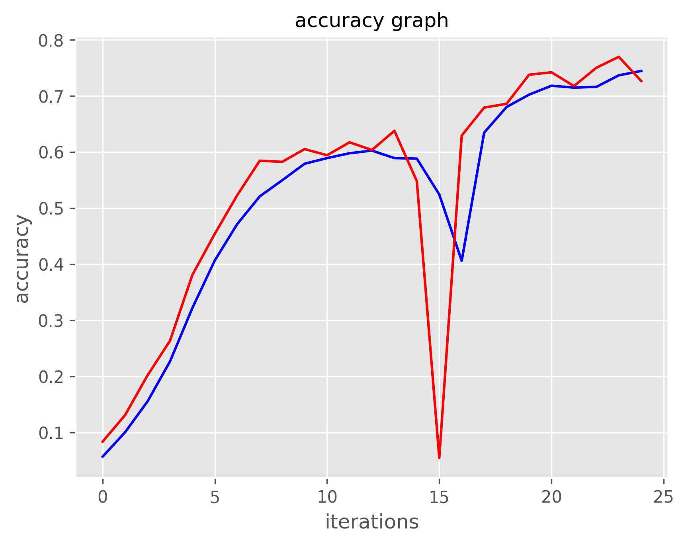
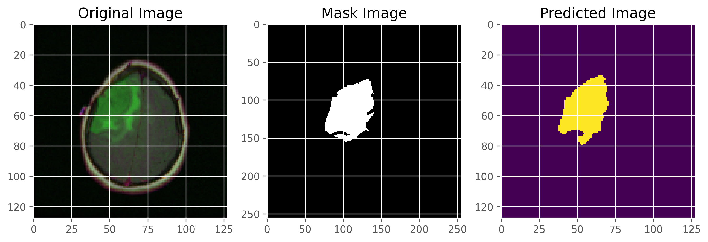
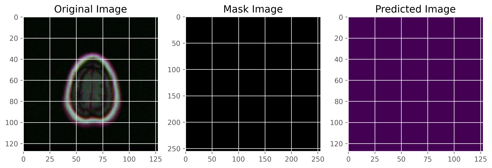
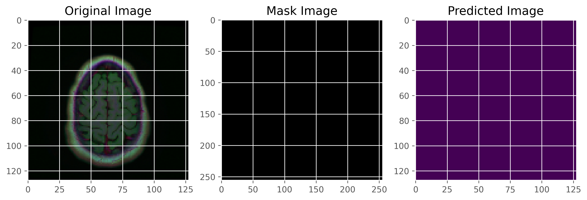

# 🧠 Brain Tumor Segmentation using U-Net (TensorFlow/Keras)

An end-to-end deep learning pipeline for automatic brain tumor
segmentation using a custom U-Net architecture trained on brain MRI
images.

This project demonstrates the complete medical image segmentation
workflow --- from model design and training to evaluation and deployment
via Hugging Face Spaces.

------------------------------------------------------------------------

## 🚀 Live Demo

Interactive web application:

👉 https://huggingface.co/spaces/himanshudixit1205/brain-tumor-ai

Upload an MRI scan (.tiff / .png / .jpg) to visualize tumor segmentation
results.

------------------------------------------------------------------------

## ✨ Key Features

-   Custom U-Net architecture implemented in TensorFlow/Keras\
-   Hybrid Binary Cross-Entropy + Dice loss\
-   Data augmentation for improved generalization\
-   Modular and reproducible training pipeline\
-   Gradio-based inference app deployed on Hugging Face Spaces

------------------------------------------------------------------------

## 📦 Dataset

The model was trained on paired brain MRI images and corresponding tumor
masks.

Preprocessing steps: - Image resizing to 128×128 resolution\
- Pixel normalization\
- Augmentation (rotation, shifts, zoom, flips)\
- Train / validation / test split

------------------------------------------------------------------------

## 📊 Validation Metrics

  Metric       Score
  ------------ --------
  Dice Score   \~0.77
  IoU          \~0.68

The model demonstrates stable convergence and consistent tumor
localization across validation samples.

> Note: Pixel-wise accuracy is typically high in segmentation tasks due
> to background dominance and is not considered a primary evaluation
> metric.

------------------------------------------------------------------------

## 📈 Training Curves

### Loss Curve

### Dice / IoU Curve

------------------------------------------------------------------------

## 🖼️ Sample Predictions

\
\

------------------------------------------------------------------------

## 📜 Project Structure

    .
    ├── src/
    │   ├── train.py        # Training pipeline
    │   ├── unet.py         # Model architecture
    │   ├── utils.py        # Data loading & metrics
    │
    ├── app.py              # Gradio inference app
    ├── config.yaml         # Training configuration
    ├── results/            # Training plots & samples
    ├── requirements.txt
    └── README.md

------------------------------------------------------------------------

## 🛠️ Tech Stack

-   TensorFlow / Keras\
-   NumPy\
-   OpenCV\
-   Matplotlib\
-   Scikit-learn\
-   Gradio\
-   Hugging Face Hub

------------------------------------------------------------------------

## 🤗 Model Hosting

Model weights are hosted on Hugging Face and used within the live demo
application:

👉 https://huggingface.co/spaces/himanshudixit1205/brain-tumor-ai

This repository includes the complete training pipeline and inference
application.

------------------------------------------------------------------------

## 🔒 Ethics & Disclaimer

This project is intended strictly for research and educational purposes.

It is not clinically validated and must not be used for medical
diagnosis or treatment decisions.

Always consult a qualified medical professional for clinical evaluation.

------------------------------------------------------------------------

## 👤 Author

**Himanshu Dixit**

------------------------------------------------------------------------

## ⭐ If You Found This Useful

Feel free to star the repository or connect with me.
